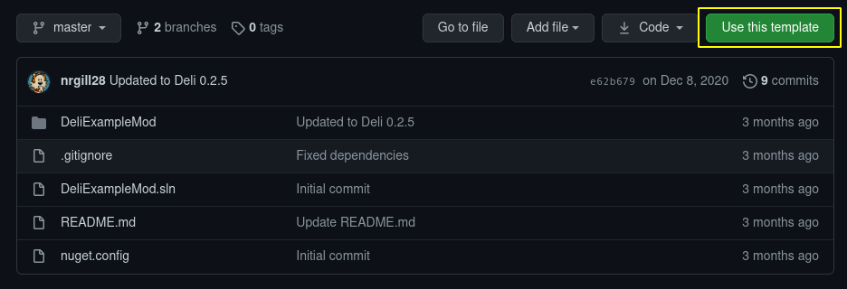

# Setting up a Solution
The example mod provides all the required infrastructure to build a mod, plus some minimal examples of the features that Deli provides.  
To get started, simply clone [the repository](https://github.com/Deli-Collective/Deli.ExampleMod).

> [!TIP]
> If you plan on publishing this repository later, use the template feature of the repository. It automatically makes a copy of the
> repository to your account (which you can rename later), allowing you to push your code.
> 

With the repository cloned, you can safely delete the `res` and `src` directories, then edit `manifest.json` (all in the `Deli.ExampleMod`
directory) to get a clean project.

This solution has the NuGet sources and packages preconfigured, including a few compile-time utilities. 

> [!NOTE]
> If you need to to reference game code, you will need to add your own references to the DLLs. For open source projects, please be
> courteous and reference them from a gitignore'd `libs` folder. Alternatively, stub the referenced DLLs and include them in the repo
> using something like `mono-cil-strip`.