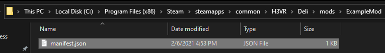
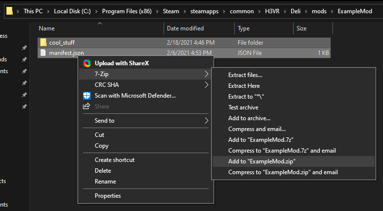
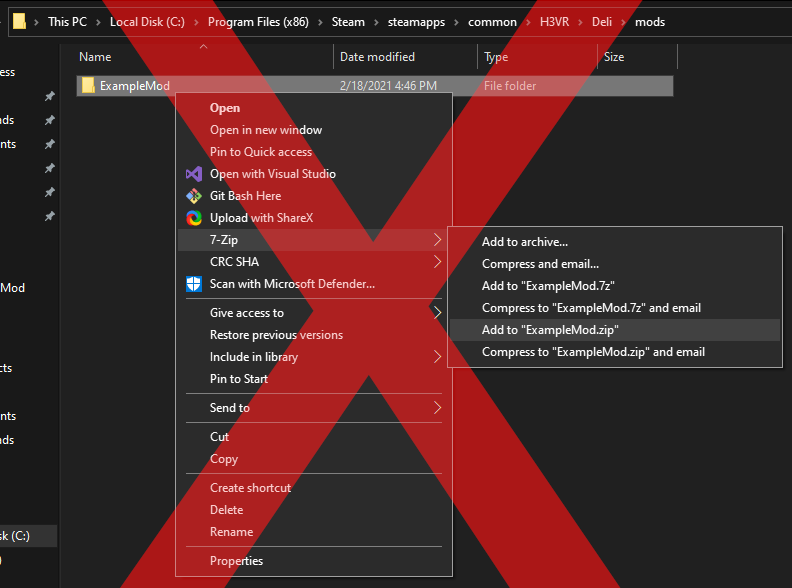
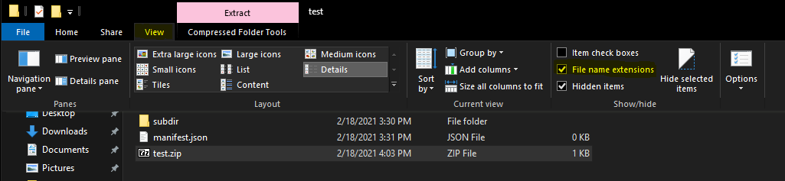
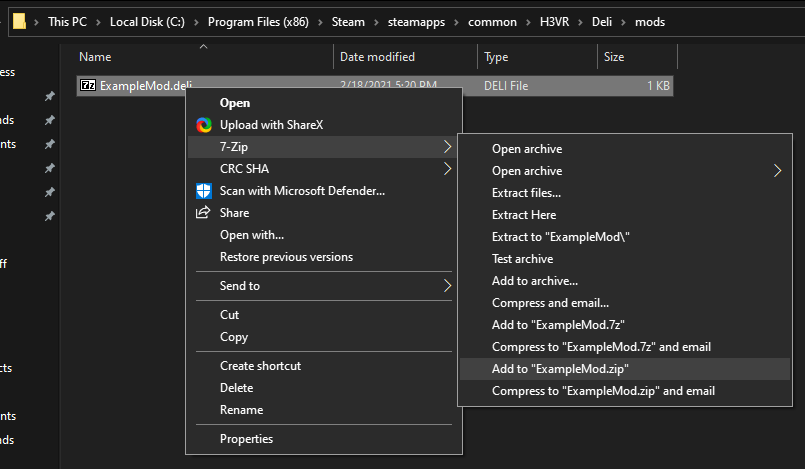

# Preparing a Mod
To actually load the content in the following guides, you need to prepare a mod so Deli knows about it.

## Creating the Manifest
The `manifest.json` file is within all Deli mods and contains information about the mod it is contained in. This information varies in
importance from mission-critical to almost never used.

The bare minimum manifest is:
```json
{
  "guid": "example",
  "version": "1.0.0",
  "require": "0.3.0"
}
```

| Name | Type | Description |
| ---- | ----- | ----------- |
| `guid` | string; lowercase alphanumeric with `.` and `_` permitted | The unique identifier for the mod. **This should not conflict with any other mod**. |
| `version` | a SemVer-compatible version | The version of the mod. |
| `require` | a SemVer-compatible version | The version of Deli that the mod needs. |

> [!NOTE]
> There are many more optional properties! Other guides will demonstrate more, and all properties can be found in
> [the schema file](../manifest.schema.json).

## Creating the Mod
A Deli mod is some form of a directory that contains a manifest file. Currently, directories and zip files are supported.

For the purposes of development, you will want a directory mod. Simply create a directory in `Deli/mods/` (title it anything; the title is not
used).  


Then, place the manifest file into the directory.  


Huzzah! Your directory has turned into a mod!

> [!WARNING]
> Do not place the manifest file directly in the mods directory, as doing so will give you a warning and nothing else. You must place the
> manifest within a subdirectory for Deli to care about it.

## Packaging the Mod
> [!TIP]
> If you have not already, you may want to follow some other guides before continuing with this guide. Packaging a mod will have no effect
> on its behaviour, so there is not point unless you wish to distribute it.

When you are ready to release, you should package your mod. Doing so means that users simply drag and drop a file into their mods
directory, and removes the complexity of multiple files and directories. Packaging is a two part process:
### Zipping
Simply zip the contents of the directory, like so:  


**Do not zip the directory itself**, or Deli will fail to find the manifest and thus fail to load the mod.  


> [!WARNING]
> Not all zip tools are created equal! Some (like PowerShell 5.1) violate [the zip file
> specification](https://pkware.cachefly.net/webdocs/casestudies/APPNOTE.TXT), primarily 4.4.17.1. We recommend 7-Zip for both users and
> creators, but the default Windows tool should be fine.

2. Change the extension of the zip file from `zip` to `deli`.
> [!NOTE]
> If you cannot see file name extensions, you may need to enable "File name extensions" in File Explorer:
> 

Your mod is now ready for release!

## Release Tips
Here's a few niche tips for when you release your mod, but make for a smoother user experience nonetheless:
1. If your release website only supports archive files (e.g. BoneTome), place the mod file within an archive and upload that archive. **Do
   not rename the mod file back to a zip**, or users will extract it directly to their mods directory. This has been documented several
   times within support channels.  
   
2. Keep a consistent file name. Many users perform a drag and drop installation and nothing more. If the file name of one version is different from
   another, a user might forget to delete the old version. This will cause both versions to fail to load, and is intended behaviour. 